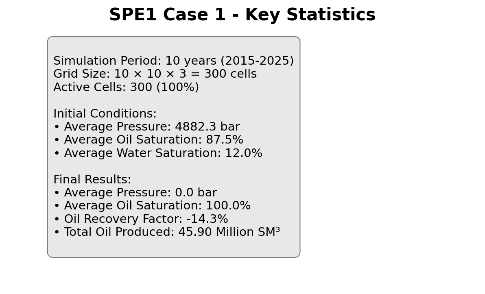
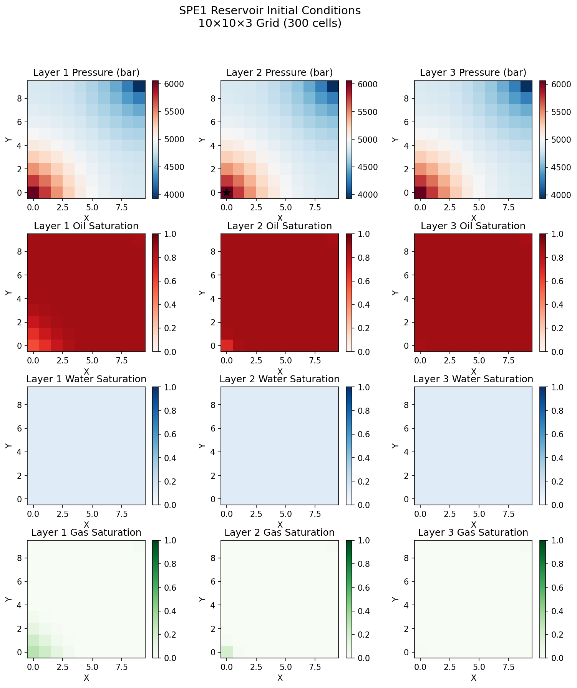

# SPE1 Case 1 - OPM Flow Simulation

This repository contains scripts to run the SPE1 Case 1 benchmark using OPM Flow simulator with automated summary data extraction.

## Prerequisites

1. **Python 3.8+** with pip
2. **Docker** installed and running
3. **SPE1CASE1.DATA** file (original Eclipse deck)

## Installation

### Option 1: Using Conda (Recommended)
```bash
# Clone this repository
git clone <repo-url> spe1-case1
cd spe1-case1

# Run the setup script to create a conda environment
./setup.sh

# Activate the environment
conda activate spe1-case1
```

### Option 2: Using pip
```bash
# Clone this repository
git clone <repo-url> spe1-case1
cd spe1-case1

# Install Python dependencies
pip install -r requirements.txt
```

### Verify Installation
```bash
# Verify Docker is running
docker --version

# Test Python dependencies
python -c "import resdata, pandas, pyarrow; print('✅ All dependencies installed')"
```

## How to Run

### Step 1: Prepare the Data
Place your original SPE1CASE1.DATA file in the `data/` directory:
```bash
cp /path/to/SPE1CASE1.DATA data/
```

### Step 2: Patch the Deck
Add a comprehensive SUMMARY section to capture simulation outputs:
```bash
python scripts/patch_summary.py data/SPE1CASE1.DATA patched/SPE1CASE1_patched.DATA
```
This creates a new deck file with monitoring for:
- Grid state (pressure, saturations)
- Field production/injection rates
- Well performance metrics
- Solver diagnostics

### Step 3: Run the Simulation
Execute OPM Flow using Docker:
```bash
python scripts/run_simulation.py patched/SPE1CASE1_patched.DATA patched/
```
This will:
- Pull the OPM Flow Docker image (first run only)
- Mount your deck as read-only
- Run the simulation
- Save outputs to `patched/` directory

### Step 4: Extract Results
Convert binary UNSMRY data to Parquet format:
```bash
python scripts/extract_results.py patched/SPE1CASE1_patched.UNSMRY
```
This creates `SPE1CASE1_patched.parquet` with time-series data.

## Complete Workflow Example

```bash
# From the repository root
cd spe1-case1

# Install dependencies
pip install -r requirements.txt

# Assume SPE1CASE1.DATA is in ~/Downloads
cp ~/Downloads/SPE1CASE1.DATA data/

# Run the complete pipeline
python scripts/patch_summary.py data/SPE1CASE1.DATA patched/SPE1CASE1_patched.DATA
python scripts/run_simulation.py patched/SPE1CASE1_patched.DATA patched/
python scripts/extract_results.py patched/SPE1CASE1_patched.UNSMRY

# View results
ls -la patched/
# Should see: *.UNSMRY, *.SMSPEC, *.RSM, *.INIT, *.parquet, etc.
```

## Repository Structure

```
spe1-case1/
├── data/                       # Original decks (untouched)
│   └── SPE1CASE1.DATA         
├── patched/                    # Auto-generated, ignored by git
├── scripts/
│   ├── patch_summary.py        # Injects/updates SUMMARY section
│   ├── run_simulation.py       # Wraps docker run … /usr/bin/flow
│   └── extract_results.py      # Reads *.UNSMRY with resdata
├── requirements.txt            # Python dependencies
├── .gitignore                 
└── README.md                  
```

## Variable Glossary

### Grid State Variables
- **BPR**: Block pressure [barsa]
- **BWSAT**: Block water saturation [fraction]
- **BGSAT**: Block gas saturation [fraction]

### Field Rates & Totals
- **FOPR/FOPT**: Field oil production rate/total [SM³/day, SM³]
- **FGPR/FGPT**: Field gas production rate/total [SM³/day, SM³]
- **FWPR/FWPT**: Field water production rate/total [SM³/day, SM³]
- **FGOR**: Field gas-oil ratio [SM³/SM³]
- **FWCT**: Field water cut [fraction]

### Well Variables
- **WBHP/WTHP**: Well bottom/tubing head pressure [barsa]
- **WOPR/WOPT**: Well oil production rate/total [SM³/day, SM³]
- **WGPR/WGPT**: Well gas production rate/total [SM³/day, SM³]
- **WWPR/WWPT**: Well water production rate/total [SM³/day, SM³]
- **WGIR/WGIT**: Well gas injection rate/total [SM³/day, SM³]
- **WWIR/WWIT**: Well water injection rate/total [SM³/day, SM³]

### Numerical Performance
- **PERFORMA**: Solver performance statistics (iterations, timesteps, etc.)

## Troubleshooting

### Docker Issues
- **Permission denied**: Run `docker` commands with `sudo` or add your user to the docker group
- **Platform warning on Mac**: The `--platform linux/amd64` flag ensures compatibility on Apple Silicon

### Common Errors
- **FileNotFoundError**: Ensure SPE1CASE1.DATA exists in `data/` directory
- **resdata import error**: Install with `pip install resdata pandas pyarrow`
- **Docker not found**: Install Docker Desktop from https://www.docker.com/

### Output Files
After successful run, `patched/` will contain:
- `*.UNSMRY` - Binary summary data
- `*.SMSPEC` - Summary specification
- `*.RSM` - Column-format summary (human-readable)
- `*.INIT` - Initial grid state
- `*.EGRID` - Grid geometry
- `*.parquet` - Extracted time-series data

## Notes

- The `patched/` directory is auto-generated and ignored by git
- Summary data is configured to output only at report steps (`RPTONLY`)
- Results are saved in Parquet format for efficient storage and analysis
- The Docker image is ~2GB on first download

## Understanding the SPE1 Dataset

### What is SPE1 Case 1?

SPE1 Case 1 is a standard benchmark problem defined by the Society of Petroleum Engineers for comparing reservoir simulators. It represents a simple oil reservoir with:

- **Grid**: 10×10×3 cells (300 total cells)
- **Physics**: Three-phase flow (oil, water, gas) with dissolved gas
- **Wells**: One producer (PROD) and one gas injector (INJ)
- **Duration**: 10-year production period

### Dataset Overview



The simulation tracks the evolution of pressure and fluid saturations in every grid cell over time, creating a rich 4D dataset (3D space + time).

### Initial Reservoir Conditions



The reservoir starts with:
- **High oil saturation** (~88%) throughout most of the reservoir
- **Pressure gradient** increasing with depth (typical hydrostatic conditions)
- **Water saturation** only at the bottom (water-oil contact)


The cross-section view shows the three-layer structure with pressure increasing with depth and high initial oil saturation.

### Production Evolution


The plots show evolution at the monitored cell (1,1,1). Over the 10-year production period:
- **Pressure declines** from 5,192 to 4,028 bar (22% reduction)
- **Gas saturation increases dramatically** from 5.5% to 55% as pressure falls below bubble point
- **Oil saturation decreases** from 82.5% to 33% (60% relative reduction)
- **Water saturation remains stable** around 12%


This stacked area chart clearly shows the fluid displacement at cell (1,1,1). As production proceeds:
- Gas (green) expands significantly as dissolved gas comes out of solution
- Oil (red) is produced, reducing from over 80% to about 33%
- Water (blue) remains relatively constant at the bottom

### Production Performance


Key production metrics:
- **Oil production rate** maintained at target until reservoir pressure can no longer sustain it
- **Cumulative production** reaches over 3 million SM³
- **Recovery factor** approaches 30% of original oil in place
- **Average pressure** declines from ~380 to ~340 bar

## Accessing the Dataset

### Summary Data (Parquet Format)

The time-series summary data is available in `patched/SPE1CASE1_PATCHED.parquet`:

```python
import pandas as pd

# Load summary data
df = pd.read_parquet('patched/SPE1CASE1_PATCHED.parquet')

# Available columns:
# - BPR:1,1,1 - Pressure at cell (1,1,1) in bars
# - BWSAT:1,1,1 - Water saturation at cell (1,1,1)
# - BGSAT:1,1,1 - Gas saturation at cell (1,1,1)
# - FOPR - Field oil production rate (SM³/day)
# - FOPT - Cumulative oil production (SM³)

# Calculate oil saturation
oil_sat = 1.0 - df['BWSAT:1,1,1'] - df['BGSAT:1,1,1']

# Plot pressure evolution
df['BPR:1,1,1'].plot()
```

### Binary Output Files

The simulation also produces binary output files in Eclipse format:
- `*.UNSMRY` / `*.SMSPEC` - Summary data (field rates, well data, selected cells)
- `*.UNRST` - Unified restart file with full grid properties at each report step
- `*.INIT` - Initial grid properties
- `*.EGRID` - Grid geometry

These can be read using the `resdata` Python package for more detailed analysis.

## Visualization Scripts

Generate these visualizations yourself:

```bash
# Create all figures
python viz_scripts/01_reservoir_overview.py
python viz_scripts/02_time_evolution.py
python viz_scripts/03_production_analysis.py
```

## Applications

This dataset is useful for:
- Testing reservoir simulation post-processing tools
- Machine learning on reservoir data (production forecasting, history matching)
- Visualization technique development
- Educational purposes in petroleum engineering
- Benchmarking data compression and storage methods